<div align="center">

# 微信.skill

### 让 AI 在本地读懂你的微信。

[](LICENSE)
[](https://claude.ai)


</div>

## 安装

需要 **Windows, 微信 PC 4.1+, [Claude Code](https://claude.com/claude-code)**。
在 Claude Code 里执行：

```
/plugin marketplace add chengmarc/wechat-to-ai
/plugin install wechat-to-ai@chengmarc
```

> 装好后不需要记任何命令，直接说人话就行。

## 首次使用

1. **保持微信登录**，然后对 Claude 说「帮我准备微信数据」。
2. Claude 会跑 `preflight` 自检，并把接下来该做什么逐条告诉你。
3. 建库这一步需要**以管理员权限**运行一次。运行期间，请在微信里**逐个点开聊天
   （新旧都开）、联系人、收藏、朋友圈并搜索** —— 微信只在相关内容被打开时才准备
   对应的数据，浏览得越全，能读到的记录越全。
4. 之后想拿到最新消息，重跑一次建库即可，日常使用直接提问。

> **Windows Defender 等杀毒软件会将本程序标记为可疑，需要手动放行。**

## 数据安全

- **数据不离机**：构建数据库、查询、导出全部在本地进程完成，没有任何网络上传。
- **无遥测**：不含任何统计、崩溃上报或更新通道；维护者在技术上无法接触到你的任何数据。
- **仅限自用**：仅用于 **在本地** 读取 **你自己的** 微信数据，遵守相关法律法规，
  不得用于未经授权的数据访问。

> 完整的法律声明、数据可携权依据与引用来源见下方 **Declarations**。

---

# Declarations

*This statement is made by the maintainer of `wechat-to-ai` and forms part of the
documentation of this project. Defined terms have the meanings given in `LICENSE`.*

### §1 — Nature and operation of the Software

1.1 `wechat-to-ai` is a **local-only** data-portability utility. Database
construction, query, and export occur entirely on the operator's own machine.

1.2 The Software performs **no network transmission of Operator Data** and
contains no telemetry, analytics, crash reporting, or update channel.

1.3 The maintainer **has no technical means of access** to any data the Software
produces. The Software reads only data already present on the operator's device
and from the account signed in there; it is not a network or remote-access tool.

### §2 — Purpose and legal basis

2.1 This project is supplied to help a natural person obtain a portable copy of
their own personal data, a right recognised in the jurisdictions in which the
project is offered, including GDPR Articles 15 and 20, PIPEDA Schedule 1
Principle 9, and the California Consumer Privacy Act.

2.2 It does not authorise any particular act. Lawfulness of use in any given
jurisdiction remains the operator's responsibility, per §6.2 of `LICENSE`.

### §3 — Findings of record concerning the WeChat platform

*The following are matters of published record by named institutions. They are
reproduced here, with citation, to document the conditions that make a local
data-portability tool necessary. Each is the finding of its author and is
attributed as such.*

| # | Source | Finding |
|---|---|---|
| 3.1 | **The Citizen Lab** — *We Chat, They Watch* (May 2020) | Documents content surveillance of files exchanged entirely among non-China-registered accounts, and their use in censorship system training. |
| 3.2 | **The Citizen Lab** — *Should We Chat, Too?* (15 October 2024) | Reports that much WeChat network traffic lacks forward secrecy, that some metadata is sent in plaintext, and that server-side message visibility is inherent to content censorship. |
| 3.3 | **Government of Canada**, Treasury Board Secretariat (30 October 2023) | Records a finding that WeChat presents an unacceptable privacy and security risk and was removed from government-issued mobile devices. |
| 3.4 | **Directly verifiable by any user** | The platform provides no facility by which a user may obtain a complete, human-readable copy of their own message history. |

3.5 Taken together, the cited record describes a platform whose servers can read
message content, that uses content analysis in censorship workflows, that has been
assessed by a G7 government as posing unacceptable privacy and security risk, and
that does not provide users with a complete human-readable export of their own
records.

**Sources:** [3.1](https://citizenlab.ca/research/we-chat-they-watch/) ·
[3.2](https://citizenlab.ca/2024/10/should-we-chat-too-security-analysis-of-wechats-mmtls-encryption-protocol/) ·
[3.3](https://www.canada.ca/en/treasury-board-secretariat/news/2023/10/minister-anand-announces-a-ban-on-the-use-of-wechat-and-kaspersky-suite-of-applications-on-government-mobile-devices.html)

### §4 — Jurisdiction, governing law, and service

4.1 Copyright in the Software is held by a natural person **resident in Canada**.
No entity organised under, or subject to, the laws of the People's Republic of
China holds any ownership interest in or control over this project.

4.2 `LICENSE` is governed by the laws of the **Province of Ontario and the federal
laws of Canada** applicable there, and disputes are subject to the exclusive
jurisdiction of the courts of Ontario (`LICENSE` §12).

4.3 This repository is hosted in the United States by GitHub, Inc. and is subject
to that provider's terms and to United States law.

4.4 The Software is not offered for distribution within the People's Republic of
China and is not represented as compliant with that jurisdiction's requirements.

### §5 — Non-affiliation and trademarks

5.1 This project is **not affiliated with, endorsed by, sponsored by, or
officially connected to** Tencent Holdings Limited, Shenzhen Tencent Computer
Systems Company Limited, or any of their affiliates.

5.2 "WeChat", "Weixin", and "微信" are trademarks of their respective owners. They
are referenced **nominatively** only to identify the data format with which the
Software interoperates.

5.3 This project contains **no source code, object code, asset, or other
copyrightable material** owned by Tencent or its affiliates, and does not modify,
patch, redistribute, or interfere with any third-party application.

### §6 — Scope of permitted use

6.1 The Software is furnished for use **on the operator's own machine**, against
**the operator's own account data**, in compliance with applicable law.

6.2 Use against any account, device, or data store that the operator is not
authorised to access is prohibited, falls outside the licence grant, and
terminates it (`LICENSE` §4.3, §11.2).

### §7 — Notice to complainants

7.1 The maintainer will consider any good-faith notice of claimed infringement or
circumvention on its merits and will act promptly where a claim is substantiated.

7.2 Notices concerning claimed circumvention under 17 U.S.C. § 1201 are evaluated
under the host provider's published policy. Where material is disabled by mistake
or misidentification, a **counter-notice may be filed** under 17 U.S.C. § 512(g).

7.3 **All takedown notices received in respect of this repository will be
published in full**, redacted only as to the personal contact details of natural
persons, in `doc/notices/`. Filing a notice constitutes acknowledgement of this
practice.

### §8 — License

8.1 `wechat-to-ai` is released under the **wechat-to-ai Source-Available License,
Version 1.0** (`LicenseRef-wechat-to-ai-1.0`) — see [`LICENSE`](LICENSE) —
© 2026 [chengmarc](https://github.com/chengmarc).

8.2 The licence is derived from the MIT License and retains its permissive grant to
use, copy, modify, publish, distribute, and sell. It is **not** the OSI-approved
MIT License and must not be catalogued as "MIT".

8.3 It adds, in summary: attribution and notice-retention conditions (§3); a
restriction on reverse-engineering the distributed binaries, **expressly subject
to the statutory reservations in §4.2** — including the non-waivable
interoperability right under Article 6 of Directive 2009/24/EC, the exceptions at
17 U.S.C. §§ 1201(f), (g) and (j), and sections 30.6, 30.61, 41.12 and 41.13 of
the Canadian *Copyright Act*; a prohibition on use against data the operator is
not authorised to access (§4.3); trademark and non-affiliation terms (§5);
warranty disclaimer, liability limitation, and indemnity (§§7–9); and Ontario
governing law and forum (§12).

8.4 By downloading, installing, executing, cloning, or forking this repository, you
accept that licence in full.
