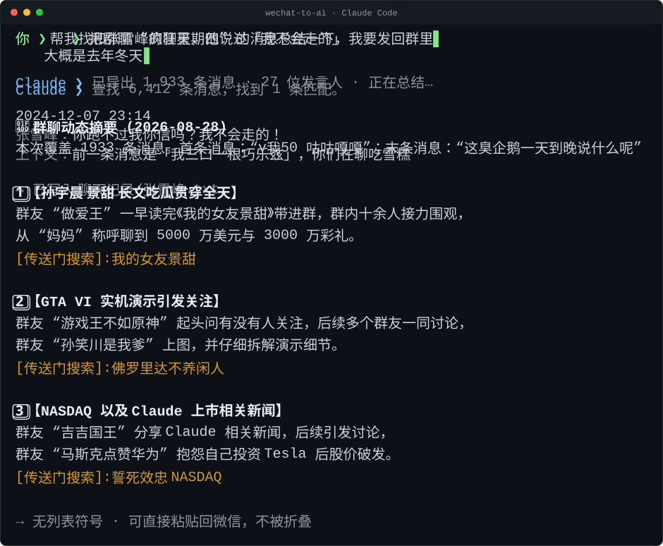

<div align="center">

  <br>

  
  

  <h1>微信.skill - 让 AI 读懂你的微信</h1>

  

</div>

## 安装

在 **Claude Code** 内执行：

```
/plugin marketplace add chengmarc/wechat-to-ai
/plugin install wechat-to-ai@chengmarc
```

## 首次使用

1. **保持微信登录**，然后对 Claude 说「帮我准备微信数据」。
2. Claude 会自动准备数据：从已登录的微信里恢复账号方案、构建可读数据库。
   全程无需管理员权限，也不用你在微信里手动操作，保持微信登录即可。
3. 数据库建好后 Claude 会自动接着往下走。日常使用直接提问；
   想拿到最新消息，对 Claude 说「更新微信数据」即可。

## 数据安全

- **数据不离机**：构建数据库、查询、导出全部在本地进程完成，没有任何网络上传。
- **无遥测**：不含任何统计、崩溃上报或更新通道；维护者在技术上无法接触到你的任何数据。
- **零网络**：程序文件随插件一起安装，运行期间不发起任何网络请求，可在断网环境下使用。
- **仅限自用**：仅用于 **在本地** 读取 **你自己的** 微信数据，遵守相关法律法规，
  不得用于未经授权的数据访问。


# Declarations

*This statement is made by the maintainer of `wechat-to-ai` and forms part of the
documentation of this project. Defined terms have the meanings given in `LICENSE`.*

### §1 — Nature and operation of the Software

1.1 `wechat-to-ai` is a **local-only** data-portability utility. Database
construction, query, and export occur entirely on the operator's own machine.

1.2 The Software performs **no network transmission of Operator Data** and
contains no telemetry, analytics, crash reporting, or update channel. Its program
files are distributed with the plugin itself, so it performs **no network activity
at all** at runtime and can be used fully offline.

1.3 The maintainer **has no technical means of access** to any data the Software
produces. The Software reads only data already present on the operator's device
and from the account signed in there; it is not a network or remote-access tool.

### §2 — Purpose and legal basis

2.1 This project is supplied to help a natural person obtain a portable copy of
their own personal data, a right recognised in the jurisdictions in which the
project is offered, including GDPR Articles 15 and 20, PIPEDA Schedule 1
Principle 9, and the California Consumer Privacy Act.

2.2 It does not authorise any particular act. Lawfulness of use in any given
jurisdiction remains the operator's responsibility, per §6.2 of `LICENSE`.

### §3 — Finding of record concerning data portability

3.1 WeChat provides no facility by which a user may obtain a complete,
human-readable copy of their own message history. This is directly verifiable by
any user, and is the condition that makes a local data-portability tool necessary.

### §4 — Jurisdiction, governing law, and service

4.1 Copyright in the Software is held by a natural person **resident in Canada**.
No entity organised under, or subject to, the laws of the People's Republic of
China holds any ownership interest in or control over this project.

4.2 `LICENSE` is governed by the laws of the **Province of Ontario and the federal
laws of Canada** applicable there, and disputes are subject to the exclusive
jurisdiction of the courts of Ontario (`LICENSE` §12).

4.3 This repository is hosted in the United States by GitHub, Inc. and is subject
to that provider's terms and to United States law.

4.4 The Software is not offered for distribution within the People's Republic of
China and is not represented as compliant with that jurisdiction's requirements.

### §5 — Non-affiliation and trademarks

5.1 This project is **not affiliated with, endorsed by, sponsored by, or
officially connected to** Tencent Holdings Limited, Shenzhen Tencent Computer
Systems Company Limited, or any of their affiliates.

5.2 "WeChat", "Weixin", and "微信" are trademarks of their respective owners. They
are referenced **nominatively** only to identify the data format with which the
Software interoperates.

5.3 This project contains **no source code, object code, asset, or other
copyrightable material** owned by Tencent or its affiliates, and does not modify,
patch, redistribute, or interfere with any third-party application.

### §6 — Scope of permitted use

6.1 The Software is furnished for use **on the operator's own machine**, against
**the operator's own account data**, in compliance with applicable law.

6.2 Use against any account, device, or data store that the operator is not
authorised to access is prohibited, falls outside the licence grant, and
terminates it (`LICENSE` §4.3, §11.2).

### §7 — Notice to complainants

7.1 The maintainer will consider any good-faith notice of claimed infringement or
circumvention on its merits and will act promptly where a claim is substantiated.

7.2 Notices concerning claimed circumvention under 17 U.S.C. § 1201 are evaluated
under the host provider's published policy. Where material is disabled by mistake
or misidentification, a **counter-notice may be filed** under 17 U.S.C. § 512(g).

7.3 **All takedown notices received in respect of this repository will be
published in full**, redacted only as to the personal contact details of natural
persons, in `doc/notices/`. Filing a notice constitutes acknowledgement of this
practice.

### §8 — License

8.1 `wechat-to-ai` is released under the **wechat-to-ai License, Version 1.1**
(`LicenseRef-wechat-to-ai-1.1`) — see [`LICENSE`](LICENSE) —
© 2026 [chengmarc](https://github.com/chengmarc).

8.2 The licence permits **local use** of the Software and redistribution of the
**unmodified** Software only. It is **not** an open-source or source-available
licence, grants **no right to the Software's source code**, and must not be
catalogued as "MIT", as open source, or as source-available.

8.3 It provides, in summary: a grant limited to local execution and unmodified
redistribution (§2), with no right to modify or create derivative works (§4.6);
a restriction on reverse-engineering the distributed binaries, **expressly subject
to the statutory reservations in §4.2** — including the non-waivable
interoperability right under Article 6 of Directive 2009/24/EC, the exceptions at
17 U.S.C. §§ 1201(f), (g) and (j), and sections 30.6, 30.61, 41.12 and 41.13 of
the Canadian *Copyright Act*; a prohibition — subject to those same reservations —
on decrypting or extracting the source from the encrypted source archive (§4.5);
a prohibition on use against data the operator is not authorised to access (§4.3);
attribution and notice-retention conditions (§3); trademark and non-affiliation
terms (§5); warranty disclaimer, liability limitation, and indemnity (§§7–9); and
Ontario governing law and forum (§12).

8.4 By downloading, installing, executing, cloning, or forking this repository, you
accept that licence in full.
